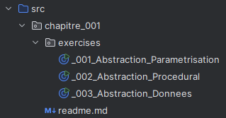
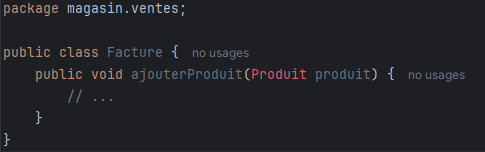
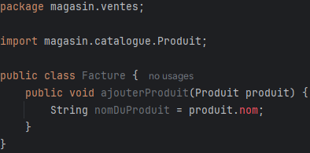
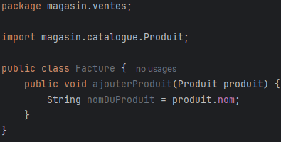

#  2. Objets et Java

## Abstraction
- Les class sont une abstraction d'un concept de la realite (p.e. 'Voiture')
- Contient les donnees (attributs) et les operations (fonctions) du concept
- Un objet est l'instance d'une class

### Class, objet et insance
- Class :
  - Une description du concept, ne contient pas de valuers mais les decrit
  - Est le 'plan de construction' d'un concept
  - Devient un `type` dans notre programme
  - p.e. La class `Voiture` a un attribut `marque`
- Objet :
  - Est la creation du plan en question, qui contiendra des valeurs
  - Une instance est un objet creer à partir d'une class.

```java
// La class, definition d'un concept, mais ne contient aucune valeur (p.e. notre attribut 'marque' n'as pas de valuer ici)
public class Voiture {
  private String marque;

  public Voiture(String marque) {
    this.marque = marque;
  }

  public void setMarque(String marque) {
    this.marque = marque;
  }

  public String getMarque() {
    return this.marque;
  }
}


public class Main {
  public static void main(String[] args) {
      // maPremiereVoiture est une instance de type 'Voiture'
      Voiture maPremiereVoiture = new Voiture("BMW");

      // maDeuxiemeVoiture est une autre instance de type 'Voiture'
      Voiture maDeuxiemeVoiture = new Voiture("Mercedes");
  }
}
```

En Java, les programmes sont donc composés de class. Tout doit etre definie dans une class.

Nous avons vu 2 techniques d'abstraction qui ont ete couvert par les class :
- abstraction procedural
- abstraction de donnees

### Abstraction procedural
- une class qui contient des methodes `static`
- la class n'a pas d'attributs, aucune interactions avec des donnees de class
- on ne crée pas d'instance pour les abstractions procedural, les fonctions static peuvent etre appelé via le nom de la class

```java
public class Calculatrice {
    // Aucun attribut
    
    // Methode static
    public static double somme(double a, double b) {
        return a + b;
    }
}


public class Main {
  public static void main(String[] args) {
      // Aucune instance de calculatrice a ete cree, fonctions static appeler via le nom de la class ('Calculatrice')
      double resultat = Calculatrice.somme(10, 20);
  }
}
```

### Abstraction donnees
- une class qui contient des attributs (donnees) et fonctions (actions) qui travaillent ensemble
- la class contient un constructeur, une fonction qui doit etre appeler avec le mot clef `new`, qui sert à creer une instance de cette class
- les fonctions ne sont pas static, elles doivent travailler avec les attributs de la class
- on crée des instances pour pouvoir travailler sur des donnees specifique à cette instance

```java
public class Vehicule {
    // Des attributs
    private double vitesse;
    
    // Constructeur, permet de creer des instances de cette class
    public Vehicule() {
        this.vitesse = 0;
    }
    
    // Des fonction
    public void accelere() {
        this.vitesse++;
    }
    
    public void freine() {
        if(this.vitesse != 0) {
            this.vitesse--;
        }
    }
    
    public int getVitesse() {
        return this.vitesse;
    }
}
```

## Encapsulation

L'encapsulation est le fait de seulement exposer les donnees et actions nécessaires d'un concept à celui qui l'utilise.

En Java, ceci est possible grâce à la visibilite des packages, class, attributs et fonctions.

Les mots clefs `public` et `private` permettent de rendre :
- une class visible / invisible en dehors de son package
- un attribut / une fonction visible / invisible en dehors da sa class

### Encapsulation : Les packages

En Java, il est possible de regrouper ses class dans des dossiers communs, connu sous le nom de `package`.

Comme exemple, nous allons prendre les exercises du premier chapitre.



Nous voyons qu'ils sont regroupés sous les packages `chapitre_001` et `excercices`

Notre class meme, nous déclarons en premiere ligne le package dans lequel notre class se trouve.

```java
// Declaration du package dans lequel nous nous trouvons
package chapitre_001.exercises;

public class _001_Abstraction_Parametrisation {
    // ...
}
```

Le packaging est une sorte d'encapsulation, pour les raisons suivantes :
- Les class definie dans un package, ont seulement access aux autres class publiques dans le meme package.
- Pour utiliser des classes definies dans d'autres packages, nous devons importer le package en question dans notre class.

Pour illustrer cet exemple, nous allons utiliser la structure suivante


Nous avons 2 class, `Produit` et `Facture`, definies dans des packages different. Si notre class `Facture` veut utiliser la class `Produit`, celle-ci doit importer le package dans lequel `Produit` se trouve, qui est donc `magasin.catalogue`

Voici la class `Produit`
```java
package magasin.catalogue;

public class Produit {
    // ...
}

```

Et la class `Facture`, qui importe le package `magasin.catalogue` pour pouvoir utiliser la class `Produit` dans sa fonction

```java
package magasin.ventes;

import magasin.catalogue.Produit;

public class Facture {
    public void ajouterProduit(Produit produit) {
        // ...
    }
}
```

Si le package n'est pas importé, nous aurons une erreur de compilation



### Encapsulation : Les attributs et fonctions

Pour continuer sur notre exemple suivant, nous allons ajouter un attribut à notre `Produit`.

```java
package magasin.catalogue;

public class Produit {
    String nom; // Equivalent a 'private String nom;'
}

```

De base, les attributs et fonctions sont `private`. Ceci veut dire qu'en dehors de cette class, nous ne pouvons pas y acceder.



Ceci nous donne donc une erreur de compilation dans notre class `Facture`, vu que le `nom` est `private`

Si nous rendons notre attribut `public`, il serra accessible en dehors de la class

```java
package magasin.catalogue;

public class Produit {
    public String nom;
}
```

Quand nous regardons maintenant, nous n'avons plus d'erreur dans notre class 'Facture'



Nous avons donc vu 2 modificateurs d'accès : `public` et `private`.

Il reste 2 autres avec une fonction bien specifique :
- Au niveau de la class = `private package`: Notre class est seulement disponible dans notre propre package
- Au niveau des attributs / fonctions = `protected`: L'attribut / fonction est seulement utilisable dans les class enfants (heritage)

Tous les modificateurs d'access sont donc utilisable sur : 
- Les classes
- Les attributs
- Les constructeurs
- Les fonctions

## Les types

Il y a 2 types de type:
- Les types primitifs
- Les types non-primitifs (class / objets)

Toute variable doit etre typee en Java

### Les types primitifs

Il existe en tout 8 type primitif en Java :
- `boolean`: `true` ou `false`
- `char`: Des caracteres avec des quotes simple, p.e. `'a'`, `'b'`, `'1'` ou une valeur ASCII
- `byte`, `short`, `short`, `int`, `long` sont des chiffres entiers
- `float` et `double` sont des chiffres decimal
- `void` n'a pas de valeur, il indique qu'une fonction ne retourne pas de valeurs.

Les types des nombres sont seulement interchangeable si on va d'un moins precis vers un plus precis

`int` -> `long` -> `float` -> `double`

### Les classes enveloppes

Les classes enveloppes sont utilisees pour transformer un primitif en non-primitif (objet). Chaque primitif a donc une class enveloppe qui lui permet de la transformer.

La difference entre les 2 est ou elle est stockee (stack ou heap, prochain chaptire).

Voici la liste des primitifs et de leur class enveloppe

`boolean` -> `Boolean`

`char` -> `Char`

`byte` -> `Byte`

`short` -> `Short`

`int` -> `Integer`

`long` -> `Long`

`float` -> `Float`

`double` -> `Double`

Il y a 2 facons de transformer un primitif en objet:
- Appeler le constructeur de la class enveloppe, en lui passant le primitif correspondant.

```java
Integer i = new Integer(25);
Double d = new Double(24.0);
```

- Appeler la fonction static `valueOf(...)` sur la class enveloppe

```java
Integer i = Integer.valueOf(25);
```

Si on est obligé d'utiliser les enveloppes, la 2ᵉ methode est preferable.

### Boxing, unboxing et autoboxing

Le boxing est la conversion d'un type primitif vers sa version non-primitif (objet), grace a par exemple la class enveloppe.

```java
// Boxing
Integer x = Integer.valueOf(25);
```

L'unboxing est donc l'inverse, la transformation d'un non-primitif vers sa version primitifs

```java
// Boxing
Integer intNonPrimitif = Integer.valueOf(25);

// Unboxing, la methode intValue transforme manuellement la valeur vers un int primitif
int intPrimitif = intNonPrimitif.intValue();

// Boxing
Double doubleNonPrimitif = Double.valueOf(25.0);

// Unboxing
double doublePrimitif = doubleNonPrimitif.doubleValue();
```

Pour le moment, nous nous sommes servies de fonctions pour
- transformer un primitif vers un objet (p.e. `Integer.valueOf(25)`)
- transformer un objet vers un primitif (p.e. `monObjetInteger.intValue()`)

Java est assez malin de faire le boxing / unboxing par rapport au type de notre variable.

Si nous utilisons la class enveloppe pour definir une variable, mais non assignons un primitif

```java
Integer i = 25;
```

OU

Si nous utilisons le type primitif pour definir la variable, mais assignongs un objet

```java
int i = Integer.valueOf(25);
```

Java va automatiquement pouvoir boxer / unboxer nos valeurs, le terme pour cette action est l'autoboxing

## La gestion de memoire

### Le stack et le heap

Le stack et le heap sont 2 emplacements dans la memoire de notre ordinateur, chacun avec un but bien precis.
- Le stack sert à stocker des valeurs primitives, et les references vers des objets
- Le heap sert a stocker des objets.

Le stack est un memoire qui est utilisé pour les variables qui ont une taille connue. (Tous nos primitifs ont une taille fixe)

```java
int a = 25; // Nous savons qu'un int a une taille de 8 byte
```

Donc java sait gerer la gestion de memoire toute seul pour le stack.

Nos objets ont une taille inconnue

```java
public class Chien {
    private String nom; // Quelle va etre la taille du nom ?
    
    public Chien(String nom) {
        this.nom = nom;
    }
}
```

Pour le heap, la gestion de memoire est donc plus compliqué. Java nous donne les outils pour reserver la memoire nescessaire dans le heap, ceci est possible grace au mot clef `new`.

Quand nous utilisons `new`, ceci doit etre combiner avec le constructeur d'une class. Ce que `new` fait, c'est reserver un espace de memoire dans le heap pour notre objet.

```java
Chien monChien = new Chien('Lucky');
```

`new` dans notre exemple renvoie donc aussi la reference vers le morceau de memoire dans le heap, et cette reference va etre stocke dans notre variable `monChien`.

Il est important de noter qu'un reference est juste l'address en memoire de notre objet, les addresses ont une taille fix est sont donc stockée sur le stack, tandis que notre objet lui meme est stocké sur le heap.

Les references peuvent etre partagee, par exemple

```java
Chien monChien = new Chien('Lucky');
Chien toujoursMonChien = monChien;
```

Ici, nous avons donc 2 variables de references sur le stack, qui contienent toutes les 2 la meme address, et qui pointent vers le meme objet sur le heap.

### Comparer des variables

Quand nous comparons des variables avec `==`, il est important de comprendre comment celle-ci sont comparees.

Pour les valeurs primitives ceci est simple, les valeurs sont comparees :

```java
int a = 25;
int b = 35;
int c = 25;

a == b; // False
a == c; // True
```

Par contre, quand nous comparons 2 objets, ce ne s'ont pas les valeurs dans l'objet qui sont comparees, mais bien les references.

```java
Chien c1 = new Chien("Lucky");
Chien c2 = new Chien("Lucky");

c1 == c2; // False, les 2 references sont differentes vu que nous avons fait 2x new.

Chient c3 = c1;
c1 == c3; // True, c1 et c3 partagent la meme reference
```

Il est possible que a un moment dans notre programme, un objet sur le heap se retrouve avec personne qui pointe vers lui

```java
Chien c1 = new Chien("Lucky"); // Un objet chien avec le nom Lucky se trouve sur le heap, c1 pointe vers lui
c1 = new Chien("Neo"); // Nous re-assignons un nouveau chien à c1, celui-ci ne pointe donc plus vers "Lucky"
```

Quand plus personne ne pointe vers un objet sur le heap, Java peut se permettre de liberee la memoire. Le garbage collector sert ici à liberer la memoire.

## La mutabilite

Un objet mutable est un objet que l'on peut changer, et objet immutable est un objet que l'on ne peut pas changer.

Un exemple d'un objet immutable est un `String`. Changer / combiner des `String` creer a chaque fois une nouvelle reference.

```java
String s1 = "ABC"; // Cree une reference pour "ABC"
String s2 = "DEF"; // Cree une reference pour "DEF"
s1 = s1 + s2; // Cree une reference pour "ABCDEF"
```

Il n'existe aucune fonction qui change le contenu d'un `String`.

Contrairement, les tableaux sont mutables.

Ceci veut dire que nous avons des fonctions sur un tableau qui nous permettent de changer le contenu du tableau

```java
// Tableau
int[] monTableau = { 1, 2, 3 };

// Changer le contenu
monTtableau[0] = 4;
```

Java a creer une class qui nous permet de changer le contenu d'un `String`, le `StringBuilder`, qui encapsule un String de facons mutable.

```java
// Creer un StringBuilder avec `ABC` en contenu
StringBuilder sb = new StringBuilder("ABC");

// Ajoute la valeur 'DEF' au contenu
sb.append("DEF");

// `.toString()` nous renvoie le contenu du builder en `String`, la variable `String monString` est immutable !
String monString = sb.toString();
```

## Appeler des methodes / fonctions

Il y a 2 facons d'appeler une method:
- Si la methode est `static`, nous utilisons le nom de la methode directement sur la class, pas besoin d'instance :
```java
MaClass.nomFonction();
```
- Si la methode n'est pas `static`, nous devons appeler le methode sur l'instance de la class
```java
MaClass maClass = new MaClass();
maClass.nomFonction();
```

### La gestion de memoire est les fonctions

Activation Record : Quand nous appelons une fonction, Java reserve de la memoire dans le stack pour les parametres et variables local de notre fonction.

```java
public class Calculatrice{
    public static int somme(int a, int b) {
        int resultat = a + b;
        return resultat;
    }
}
```

Dans notre exemple precedent, quand une personne appelle la fonction `somme`, nous réservons de la place sur le stack pour:
- Les parametres `a` et `b`
- La variable `resultat`

Les valeurs que l'on passe à notre fonction

```java
int x = Calculatrice.somme(10, 20);
```

Sont copié dans les places reservees (`10` -> `a`, `20` -> `b`).

## Le Type Safety

Le type safety consiste de 3 parties:
- Le Type Checking (controle du typage)
- Automatic Storage Management (gestion automatic de memoire)
- Array Bound Checking (controle de limite de tableau)

### Le Type Checking
Java est un langage fortement type, ceci veut dire que tout (variables, parametres, valeurs de retour) doit etre type.

Il est donc impossible d'assigner un type qui n'est pas compatible à un autre, p.e. 

```java
String a = 123; // Erreur de compilation
```

### Automatic Storage Management
Java s'occupe de la gestion de memoire du heap. Quand objet n'a plus de references, celui-ci peut etre liberer par le garbage collector.

### Array Bound Checking
Java a un dernier controle en place, celui-ci est le fait de limiter l'acces au tableau.

Quand un tableau est cree avec 3 places, Java va lancer une erreur si on essaye d'acceder à un index autre que `0`,`1`,`2`

```java
// Un tableau avec 3 places
int[] monTableau = {10, 20, 30};

int chiffre = monTableau[3]; // Erreur, l'index maximal est 2
```

## Hiérarchie

En Java, les objets peuvent etre organiser par hierarchie

```java
public class Animal {
    public string nom;
    
    public Animal(String nom) {
        this.nom = nom;
    }
}

public class Chien extends Animal {
    public Chien(string nom) {
        super(nom);
    }
    
    public void abboyer() {
      System.out.println("WOOF");
    }
}
```

Le parent (`Animal`) est nommé le `supertype` de l'enfant (`Chien`).

L'enfant est nommé le `subtype` (sous-type) du parent.

Les subtype heritent tous les fonctionalitees de leurs supertypes, ceci est donc une forme d'abstraction.

Il y a 2 types de relations :
- transitive: Si `A` est un subtype de `B`, et `B` est un subtype de `C`, `A` est un subtype de `C`
- reflexive: `A` est un subtype de lui meme ?

### La substitution

Si nous reprenons notre exemple de `Animal` et `Chien`. Notre type `Chien` peut etre utiliser dans tout contexte ou `Animal` est attendu.

Par exemple

```java
Animal[] animeaux = new Animal[5];
animeaux[0] = new Chien("Lucky");
```

Nous définissons un tableau de type `Animal`. Vu que `Chien` est un subtype de `Animal`, il est possible d'ajouter un `Chien` a ce tableau.

Nous pouvons donc substituer un subtype par son supertype.

Si nous substituons un subtype par un supertype, les fonctionalitees de se subtype ne sont plus accessible.

Dans notre exemple, la methode `abboyer` n'est pas accesible à partir de notre chien de type `Animal`, parce qu'il est definie sur le subtype.

Tout non-primitifs en Java est un subtype du type `Object`. Ce type nous offre 2 methodes
- `boolean equals(Object o)` -> comparer 2 objets
- `String toString()` -> renvoie une representation de l'objet en format `String`

Il est donc toujours possible de definir un supertype, mais d'y assigner un subtype

```java
Objet a = "123";
Animal monAnimal = new Chien("Lucky");
```

Les methodes disponible sont celles du type definie, et pas assigne !

Par contre, il est important de savoir qu'en memoire (dans le heap), l'objet a le type que l'assignation.

```java
Animal monAnimal = new Chien("Lucky"); // Le type de variable est 'Animal', mais en memoire, nous avons un objet de type `Chien`
```

### Le casting / conversion des objets

Il est quand meme possible de manuellement convertir un type vers un de ses supertype / subtype.

Pour faire une coversion de type, il suffit d'ajouter le type entre parentheses.

```java
Object monObjet = "Tamara";
String monString = (String) monObjet;
```

Nous pouvons seulement converter un type vers un autre s'il est compatible :

```java
String monString = "Tamara";
int monInt = (int) monString; // Erreur de compilation, 'int' n'est as un super/sub type de 'String'
```

```java
Object monObjet = 123;
// Pas d'erreur de compilation, String est un subtype d'Object.
// Par contre, il n'est pas possible de convertir un int en String, nous aurons donc une Erreur à l'execution du programme (ClassCastException)
String monString = (String) monObjet; 
```

Le casting est utile pour acceder aux fonctionalitees d'un subtype.

```java
Object monObjet = "123";

// Erreur de compilation
// .length() est une methode definie dans la class String, le type de notre objet ici est `Object`, qui ne contient pas cette methode
if(monObjet.length() > 0) {
    // ...
}

// Nous savons que la valeur de monObjet est un String, donc nous pouvons le cast vers le type `String`
String monString = (String) monObjet;

// Pas d'erreur de compilation
// monString est de type `String` qui contient la methode `.length()`
if(monString.length() > 0) {
    // ...
}
```

### Le casting / conversion des primitives

Les primitifs sont aussi convertible entre eux, si compatible

`byte` -> `short`, `int`, `long`, `float`, `double`

`short` -> `int`, `long`, `float`, `double`

`int` -> `long`, `float`, `double`

`long` -> `float`, `double`

`float` -> `double`

## L'overloading (surcharge) des fonctions

Il est possible de definir la meme methode plusiers fois, mais avec des types de parametre differents

```java
public class Calculatrice {
    public static int somme(int a, int b) {
        return a + b;
    }
    
    public static long somme(long a, long b) {
        return a + b;
    }

    public static double somme(double a, double b) {
        return a + b;
    }
}
```

La class `Calculatrice` surcharge la methode `somme`.

Il y a toutefois un probleme d'ambiguïté :

Un `int` peut etre converti en `long` ou `double`, comment Java choisi t'il la bonne methode ?

Java choisira la methode la plus specifique, dans notre cas, si nous passons 2 `int` a notre methode `somme`, il choisira la premiere.

Si nous passons 2 `float` a notre methode, il choisira la derniere, parce qu'un `float` ne peut pas etre converti vers un `int` n'y un `long`

## Le dispatching

Comme nous l'avons deja dit, ce n'est pas parce que nous définissons une variable d'un certain type, qu'en memoire cet objet est du meme type

```java
Object monObjet = "ABC";
```

Notre variable ici est de type `Object`, alors que sur le heap, nous avons bien un objet de type `String`

Ceci est important à savoir, parce qu'un subtype peut 'ecraser' une methode d'un supertype. Ceci est le cas pour la fonction `.equals(...)` de `String` et `Object`.

Sur le type `Object`, la fonction `.equals(Object o)` va comparer les references des 2 objets, et rendre `true` si elles sont le meme.

Le type `String` ecrase cette fonction, et va à son tour comparer les valeurs des strings et pas la reference.

```java
Object unObjet = new Object();
Object unAutreObjet = new Object();

bool result = unObjet.equals(unAutreObjet); // False, 2 references different
```

```java
Object unObjet = "123";
Object unAutreObjet = "123";

bool result = unObjet.equals(unAutreObjet); // True, 2 meme valeurs
```

Dans le derniere exemple, nous voyons que meme si le type de nos 2 string est `Object`, la methode `equals` renvoie quand meme `true` ?

Ceci est grace au dispatching. Le dispatching va prendre la fonction la plus specifique possible du type definie en memoire, et pas du type de la variable.

En memoire, nos 2 objets ont bien un type `String`, le type `String` ecrase la fonction `equal`, donc celle-ci va etre utiliser au lieu de celle du type `Object`

## Conversion de String vers primitif

Les class enveloppe de nos primitifs nous permettent de convert un `String` dans le type primitif en question.

```java
String monStringEntier = "123";
int monInt = Integer.parseInt(monStringEntier);

String monStringDecimal = "123.25";
float monFloat = Float.parseFloat(monStringDecimal);
```

## Les collections

Jusqu'à maintenant, quand nous devons traiter plusieurs elements du meme type, nous utilisons un tableau

```java
int[] monTableau = new { 1, 2, 3 };
```

Java nous offre des interfaces qui ajoutent du comportement et des methodes a nos tableaux.

### interface: List

`List` est une `interface`.

Une interface est comme un contrat, ou nous définissons les fonctions disponibles du contrat.

L'interface n'implemente pas les fonctions, des class peuvent etre cree qui implementent les fonctions definies dans notre interface.

Cette interface peut etre utiliser comme type de variable, mais ne peut donc pas etre creer, la creation de l'objet se fait avec un class qui implemente cet interface, par exemple `ArrayList`

```java
import java.util.ArrayList;

// Type de variable = List
// Type de l'objet = ArrayList (qui implemente List)
List<int> maListe = new ArrayList<int>();
```

Nous passons le type des elements dans des `<>`, qui se met directement derriere `List`, p.e. une list de `int`: `List<int> maList`

L'interface `List` a le comportement suivant :
- Ordonne automatiquement les elements quand la list change (ajout d'un element)
- Peut contenir des doublons

### interface: Set

Set correspond à un ensemble mathematique

L'interface a le comportement suivant :
- Ne peut pas contenir de doublons
- A 2 implementations : `HashSet` et `TreeSet`

### implementation: ArrayList

`ArrayList` est une implementation de l'interface `List`. Il représente un tableau d'objets de taille dynamique (la ou un tableau normal a toujours une taille fix, le ArrayList s'agrandi tout seul quand il est remplie).

L'indexation d'un `ArrayList` est le meme que celui d'un tableau, il commence à `0`.

Pour connaitre la taille d'un `ArrayList`, nous utilisons la fonction `size()`

Nous devons definir le type des elements dans un ArrayList grace a `<>`, que l'on met directement derriere

```java
import java.util.ArrayList;

List<String> mesStrings = new ArrayList<String>();
```

Le type des elements peuvent etre des primitifs et non-primitifs

Pour ajouter un element a notre `ArrayList`, la methode `add(T element)` est prevu

```java
import java.util.ArrayList;

List<String> mesStrings = new ArrayList<String>();
int size = mesStrings.size(); // 0

mesString.add("Tanguy");
size = mesStrings.size();  // 1
```

Pour acceder a un element à un index specifique, nous avons la fonction `get(int index)`;

```java
import java.util.ArrayList;

List<String> mesStrings = new ArrayList<String>();
mesString.add("Tanguy");

String monString = mesStrings.get(0); // Contient le string "Tanguy"
```

Nous pouvons changer un element à un index precis grace à la methode `set(int index, T element)` 

```java
import java.util.ArrayList;

List<String> mesStrings = new ArrayList<String>();
mesString.add("Tanguy");
mesString.add("Tamaraaa");

mesString.set(1, "Tamara"); // Remplace element a index 1
```

Nous pouvons supprimer un element a un index precis grace à la methode `remove(int index)`

```java
import java.util.ArrayList;

List<String> mesStrings = new ArrayList<String>();
mesString.add("Tanguy");
mesString.add("Tamara");

mesString.remove(1); // Enleve "Tamara" de la liste
```