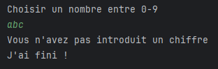

# 4. Exceptions

Les exceptions sont un mechanisme pour remonter une erreur au consommateur d'une fonction.

Le principe est le suivant :
- Si la fonction se déroule normalement, la valeur de retour est renvoyée.
- Si un probleme surgit, la fonction renvoie une exception

Prennons notre code la calculatrice

```java
public class Calculatrice {
    public static double diviser(double a, double b) {
        return a / b;
    }
}
```

Pour la division, comme il est impossible de diviser par `0`, le programme doit empêcher cette action.

Nous pouvons donc jeter (`throw`) une nouvelle (`new`) exception (de type `IllegalArgumentException`, il existe plusieurs types d'exceptions qui decrivent le probleme qui est survenu, le `IllegalArgumentException` veut dire qu'un des arguments a une valeur illegal) si `b` est 0.

```java
public class Calculatrice {
    public static double diviser(double a, double b) {
        if(b == 0) {
            throw new IllegalArgumentException("'B' ne peut pas etre 0");
        }

        return a / b;
    }
}
```

L'explication de la syntax suivra dans ce chapitre, pour le moment, c'est le resultat qui nous importe.

Si nous essayons maintenant de diviser par '0'

```java
class Main {
    public static void main(String[] args) {
        double c = Calculatrice.diviser(1, 0);
        System.out.println(c);
    }
}
```

Le resultat ne serra pas imprime, mais notre erreur serra affichée dans la console


Le programme est donc interrompu quand une exception, jusqu'à ce que :
- quelqu'un l'attrape (`try`/`catch`/`finally`)
- si personne ne l'attrape, l'exception remonte (nommer `bubble up` en anglais), jusqu'au point d'entree du programme, souvent notre fonction `main`.

## Jeter une exception

Les exceptions sont des `objects` en Java, ceci veut dire que si nous voulons en creer une, il faut utiliser le mot clefs `new`.

Il existe plusieurs types d'exceptions en Java, mais toutes héritent d'une class de base nommée `Exception`.

Le type de base `Exception` nous offre 1 attribut commun, qui est le `message`, donnant plus d'infos sur l'erreur qui vient de surgir.

Dans notre exemple, nous avons utilisé l'exception de type `IllegalArgumentException`, signale que l'argument d'une fonction est illegal.

Juste avec cette info-là, nous n'avons pas assez de detail pour savoir quel est le probleme exact.

C'est pour ça que nous avons l'attribut du message en plus, qui nous permet de donner plus de detail pour cette exception.

En passant le message `"'B' ne peut pas etre 0"`, nous savons exactement quel parametre est problematique quand cette exception est lancee.

Nous avons donc cree une exception avec un message de cette facon : 

```java
new IllegalArgumentException("'B' ne peut pas etre 0");
```

La creation ne suffit pas, il faut aussi la jeter, avec le mot clef `throw` (qui veut dire 'jeter' en anglais).

```java
throw new IllegalArgumentException("'B' ne peut pas etre 0");
```

Quand nous jetons une exception, celle-ci va donc sortir de notre fonction actuelle et revenir au point ou notre fonction a ete appeler, mais au lieu d'avoir la valeur de retour, celle-ci va rendre une exception qui doit etre attrapée.

Dans notre exemple

```java
public class Calculatrice {
    public static double diviser(double a, double b) {
        if(b == 0) {
            throw new IllegalArgumentException("'B' ne peut pas etre 0");
        }
        
        // La fonction ne vient pas jusque ici si l'exception est jetée, 

        return a / b;
    }
}
```

```java
class Main {
    public static void main(String[] args) {
        // L'exception est jetee de cette fonction.
        double c = Calculatrice.diviser(1, 0);
        
        System.out.println(c);
    }
}
```

L'exception va remonter la pille de fonctions jusqu'à ce que quelqu'un l'attrappe, si personne ne l'attrape, un message d'erreur va surgir dans la console, comme dans notre exemple.

Voici un exemple de fonction embriquees, pour montrer l'effet du `bubble up`.

```java
class Main {
    public static void main(String[] args) {
        a();
    }

    static void a(){
        b();
    }

    static void b(){
        c();
    }

    static void c(){
        throw new IllegalArgumentException("Oups ...");
    }
}
```


Ici, nous avons definie plusieurs fonctions :
- une fonction `a` qui appelle une fonction `b`
- une fonction `b` qui appelle une fonction `c`
- une fonction `c` qui jette une exception

Quand l'exception est lancee dans `c`, elle va remontee dans `b`.

Vu que `b` ne l'attrape pas, `b` va la faire remonter dans `a`

Vu que `a` ne l'attrape pas, `a` va la faire remonter dans `main`

Vu que `main` ne l'attrape pas, celle-ci serra affichée dans la console.

L'erreur montrée dans la console nous montre le chemin parcouru par l'exception, avec le plus de detail possible
- Le type: `IllegalArgumentException`
- Le message: `Oups ...`
- La pile de fonctions : `c` -> `b` -> `a` -> `main`

Quelques fois, au lieu de faire `crasher` le programme, nous aimerons nous meme gerer l'exception, en les attrapant.

## Attraper une exception

Prenons le prochain programme comme base

```java
import java.util.Scanner;

class Main {
    public static void main(String[] args) {
        int monNombre = DemanderNombre();
        System.out.println("Votre nombre est: " + monNombre);
        System.out.println("J'ai fini !");
    }

    static int DemanderNombre() {
        Scanner scanner = new Scanner(System.in);

        System.out.println("Choisir un nombre entre 0-9");
        int nombre = scanner.nextInt();

        if(nombre < 0 || nombre > 9) {
            throw new IllegalStateException("Le nombre n'est pas entre 0 et 9");
        }

        return nombre;
    }
}
```

Nous avons une fonction qui demande un nombre entre 0 et 9. Si la regle n'est pas respectee, nous jetons une exception de type `IllegalStateException`, qui veut dire que l'etat du programme est illegal.

Voici le resultat de cette operation si nous entrons un nombre non-respectee


Comme vousn le voyez, n'y la phrase "Votre nombre est ...", n'y "J'ai fini" est imprimee, parce que si personne n'attrape l'exception, celle-ci remonte jusqu'à sortir du programme.

Au lieu d'afficher la pile d'erreur complete, nous aimerons gerer l'exception nous meme et juste montrer le message, pour cella, nous devons empêcher l'exception de sortir du programme, et il faut donc l'attraper.

Quand le code est susceptible de lancer une exception, nous pouvons l'entourer d'un block `try`(essaye en anglais) / `catch` (attrape en anglais)

```java
class Main {
    public static void main(String[] args) {
        try {
            int monNombre = DemanderNombre();
            System.out.println("Votre nombre est: " + monNombre);
        } catch (Exception e) {
            // Faire quelque chose l'exception
        }

        System.out.println("J'ai fini !");
    }

    static int DemanderNombre() {
        Scanner scanner = new Scanner(System.in);

        System.out.println("Choisir un nombre entre 0-9");
        int nombre = scanner.nextInt();

        if(nombre < 0 || nombre > 9) {
            throw new IllegalStateException("Le nombre n'est pas entre 0 et 9");
        }

        return nombre;
    }
}
```

Quand nous attrapons une exception (`catch`), nous sommes obligés de definir le type de l'exception qui nous interesse.

L'heritage des types est important ici, toutes exceptions d'un sous-type seront attrapees si nous mettons un type parent.

Au debut de ce cours, nous avons dit que toute exception heritee du type `Exception`, donc si nous attrapons le type `Exception`, toutes nos exceptions serront attrapées par le `catch`.

Executons le program avec un chiffre non-valide


Premièrement, il n'y a pas d'erreur dans la console. Ceci est normal, on attrape notre exception, mais pour le moment, on n'en fait encore rien.

Deuxièmement, la phrase "Votre nombre est : " n'est toujours pas imprimée. Ceci est normal aussi, si une exception est lancee dans notre block `try`, on quitte immediatement le block pour entrer dans le block `catch`.

Finalement, cette fois si, la phrase "J'ai fini !" c'est bien imprimée dans notre console, contrairement à l'exemple precedent.

En effet, si nous mettons des block `try`/`catch` autour de notre code, l'exception serra traitée dans le catch, et notre code continu donc normalement apres le block `catch`.

Dans notre exemple, notre block catch ne sert pas encore à grand-chose, à part capturer l'exception. Ajoutons quelque pour imprimer le message de l'exception.

```java
class Main {
    public static void main(String[] args) {
        try {
            int monNombre = DemanderNombre();
            System.out.println("Votre nombre est: " + monNombre);
        } catch (Exception e) {
            String message = e.getMessage();
            System.out.println(message);
        }

        System.out.println("J'ai fini !");
    }

    static int DemanderNombre() {
        Scanner scanner = new Scanner(System.in);

        System.out.println("Choisir un nombre entre 0-9");
        int nombre = scanner.nextInt();

        if(nombre < 0 || nombre > 9) {
            throw new IllegalStateException("Le nombre n'est pas entre 0 et 9");
        }

        return nombre;
    }
}
```

Vu que `Exception` est un objet, celle-ci contient des attributs et des fonctions. La fonction `getMessage()` nous renvoie le message specifie dans notre exception.

Nous pouvons donc l'imprimer pour montrer à l'utilisateur qu'il y a eu un probleme.


Des fonctions peuvent parfois lancer des exceptions de plusieurs types. Notre fonction en fait parti (subtilement).

Nous jetons de notre part l'exception `IllegalStateException`, mais la fonction `scanner.nextInt()`


Lance potentiellement 3 exceptions :
- `InputMismatchException` : Lancee si ce que l'utilisateur entre n'est pas un chiffre
- `NoSuchElementException` et `IllegalStateException`: Des exceptions techniques par rapport à l'etat du scanner.

Essayons de faire monter le `InputMismatchException` en tappant une lettre au lieu d'un chiffre


Voici le type de notre exception au moment du catch, qui est donc bien de `InputMismatchException`


Voici le resultat


Nous voyons que le message imprime est `null`. Nous ne sommes pas obligé d'ajouter un message à une exception, quand le type de l'exception est assez clair.

Nous aimerons quand meme informer l'utilisateur du probleme qui est survenu, il faut donc savoir traiter different types d'exceptions.

Ceci est possible, nous ne sommes pas restraint à 1 block `catch`, mais pouvons en ajouter plusieurs.

Ajoutons un block catch specifiquement pour l'exception `InputMismatchException`

```java
class Main {
    public static void main(String[] args) {
        try {
            int monNombre = DemanderNombre();
            System.out.println("Votre nombre est: " + monNombre);
        }
        catch (InputMismatchException e) {
            System.out.println("Vous n'avez pas introduit un chiffre");
        }
        catch (Exception e) {
            String message = e.getMessage();
            System.out.println(message);
        }

        System.out.println("J'ai fini !");
    }

    static int DemanderNombre() {
        Scanner scanner = new Scanner(System.in);

        System.out.println("Choisir un nombre entre 0-9");
        int nombre = scanner.nextInt();

        if(nombre < 0 || nombre > 9) {
            throw new IllegalStateException("Le nombre n'est pas entre 0 et 9");
        }

        return nombre;
    }
}
```

Quand on regarde le resultat maintenant :



Nous avons la phrase correcte pour notre erreur.

Si nous voulons executer le meme block de code pour plusieurs exceptions, il est possible de combiner plusieurs types dans 1 seul `catch`. Si nous voulons montrer le meme message pour les 3 exceptions possibles de `scanner.nextInt()`, nous pouvons les separer d'un `|`

```java
class Main {
    public static void main(String[] args) {
        try {
            int monNombre = DemanderNombre();
            System.out.println("Votre nombre est: " + monNombre);
        }
        catch (NoSuchElementException | IllegalStateException | InputMismatchException e) {
            System.out.println("Vous n'avez pas introduit un chiffre");
        }
        catch (Exception e) {
            String message = e.getMessage();
            System.out.println(message);
        }

        System.out.println("J'ai fini !");
    }

    static int DemanderNombre() {
        Scanner scanner = new Scanner(System.in);

        System.out.println("Choisir un nombre entre 0-9");
        int nombre = scanner.nextInt();

        if(nombre < 0 || nombre > 9) {
            throw new IllegalStateException("Le nombre n'est pas entre 0 et 9");
        }

        return nombre;
    }
}
```

Il y a une regle à respecter quand nous utilisons plusieurs block `catch`: Java s'arretera au premier block catch qui correspond au type OU a un type enfant, commencer du haut vers le bas.

Mettre un `catch` de type `Exception` en premier, attrapera donc toutes les exceptions.

Heureusement, notre IDE nous montre quand c'est le cas


Ici, vu que `InputMismatchException` est un enfant de `Exception`, jamais notre code du block `catch InputMismatchException` serra executer, d'où l'erreur de compilation.

Quand nous attrapons une exception, il est possible de quand meme continuer la remonte de cette exception (`bubble up`).

Ceci peut p.e. etre pratique si nous voulons stocker une information par rapport à l'erreur dans une source externe, comme un fichier, mais que notre programme remonte donc l'exception au lieu de continuer apres le `catch`

Pour parvenir à ceci, il suffit de `throw` notre exception existante à partir du `catch`

```java
class Main {
    public static void main(String[] args) {
        try {
            int monNombre = DemanderNombre();
            System.out.println("Votre nombre est: " + monNombre);
        }
        catch (InputMismatchException e) {
            System.out.println("Vous n'avez pas introduit un chiffre");
            throw e;
        }
        catch (Exception e) {
            String message = e.getMessage();
            System.out.println(message);
            throw e;
        }

        System.out.println("J'ai fini !");
    }

    static int DemanderNombre() {
        Scanner scanner = new Scanner(System.in);

        System.out.println("Choisir un nombre entre 0-9");
        int nombre = scanner.nextInt();

        if(nombre < 0 || nombre > 9) {
            throw new IllegalStateException("Le nombre n'est pas entre 0 et 9");
        }

        return nombre;
    }
}
```

Voici le resultat


Comme vous le voyer, notre programme n'a pas imprimé "J'ai fini !", parce que dans notre `catch`, on `throw` notre exception de retour, ce qui va la faire remonter. 

Que faire si dans les 2 cas (`try` ou `catch`) nous voulons assurer que notre phrase "J'ai fini !" est execute, meme si notre `catch` relance l'exception ?

Nous pouvons utiliser le block `finally`, qui est un morceau de code qui serra execute dans tous les cas.

Voici la version final

```java
class Main {
    public static void main(String[] args) {
        try {
            int monNombre = DemanderNombre();
            System.out.println("Votre nombre est: " + monNombre);
        }
        catch (InputMismatchException e) {
            System.out.println("Vous n'avez pas introduit un chiffre");
            throw e;
        }
        catch (Exception e) {
            String message = e.getMessage();
            System.out.println(message);
            throw e;
        }
        finally {
            System.out.println("J'ai fini !");
        }
    }

    static int DemanderNombre() {
        Scanner scanner = new Scanner(System.in);

        System.out.println("Choisir un nombre entre 0-9");
        int nombre = scanner.nextInt();

        if(nombre < 0 || nombre > 9) {
            throw new IllegalStateException("Le nombre n'est pas entre 0 et 9");
        }

        return nombre;
    }
}
```

Et le resultat :


Nous voyons que meme si notre exception est relancee, la phrase "J'ai fini !" est bien imprimee.

Quand nous relançons une exception à partir d'un catch, nous ne sommes pas obligees de relancer la meme exception.

S'il est preferable de lancer un autre type d'exception dans notre catch, nous pouvons le faire comme ceci

```java
class Main {
    public static void main(String[] args) {
        try {
            int monNombre = DemanderNombre();
            System.out.println("Votre nombre est: " + monNombre);
        }
        catch (InputMismatchException e) {
            System.out.println("Vous n'avez pas introduit un chiffre");
            throw new IllegalStateException("Je relance une autre exception !");
        }
        catch (Exception e) {
            String message = e.getMessage();
            System.out.println(message);
            throw e;
        }
        finally {
            System.out.println("J'ai fini !");
        }
    }

    static int DemanderNombre() {
        Scanner scanner = new Scanner(System.in);

        System.out.println("Choisir un nombre entre 0-9");
        int nombre = scanner.nextInt();

        if(nombre < 0 || nombre > 9) {
            throw new IllegalStateException("Le nombre n'est pas entre 0 et 9");
        }

        return nombre;
    }
}
```

Ce qui donne le resultat suivant


Nous voyons que le program crash avec l'exception de type `IllegalStateException`, et pas le type originel `InputMismatchException`.

Pour recapituler :
- Pour lancer une exception:  `throw new MonException();`
- Pour gerer des exceptions de code mettre la partie a executer dans un `try`, et la partie attrapage dans un `catch`
- Il est possible de definir plusieurs `catch`, pour chaque type d'exception
- Un catch peut faire remonter une exception grace a `throw`
- Si vous voulez executer une partie de code dans tous les cas du `try`/`catch`, utiliser le block `finally`

## Creer nos propre exceptions

Il est possible de creer des exceptions propres à notre projet, qui contienent plus d'informations que les exceptions standard.

Dans notre programme de demande de nombres, nous aimerons ajouter le nombre qui a ete introduit dans notre exception. Nous allons donc creer une exception qui nous permet de faire ça.

Une exception est une class comme une autre, qui a comme super-type une `Exception` ou un enfant de `Exception`.

```java
class NombrePasValideException extends RuntimeException {
    private int nombre;

    public NombrePasValideException(int nombre){
        super();
        this.nombre = nombre;
    }

    public NombrePasValideException(int nombre, String message){
        super(message);
        this.nombre = nombre;
    }

    public int getNombre() {
        return this.nombre;
    }
}
```

Notre class `NombrePasValideException` a donc :
- extends de la class `RuntimeException` (plus d'info sûre ce type d'exception plus tard dans le chapitre)
- 1 attribut private `nombre` qui contient le nombre qui n'est pas valide
- 1 constructeur qui prend le nombre en parametre
- 1 constructeur qui prend le nombre et un message en paramatre
- 1 methode public `int getNombre()` qui nous rend le nombre

Au lieu d'utiliser le `IllegalStateException` dans notre programme, nous pouvons maintenant utiliser notre exception custom

```java
class Main {
    public static void main(String[] args) {
        try {
            int monNombre = DemanderNombre();
            System.out.println("Votre nombre est: " + monNombre);
        }
        catch (InputMismatchException e) {
            System.out.println("Vous n'avez pas introduit un chiffre");
        }
        catch (NombrePasValideException e) {
            System.out.println("Le nombre " + e.getNombre() + " ne se trouve pas entre 0-9");
        }

        System.out.println("J'ai fini !");
    }

    static int DemanderNombre() {
        Scanner scanner = new Scanner(System.in);

        System.out.println("Choisir un nombre entre 0-9");
        int nombre = scanner.nextInt();

        if(nombre < 0 || nombre > 9) {
            throw new NombrePasValideException(nombre);
        }

        return nombre;
    }
}
```
Qui nous donne l'info 


## Specification d'exceptions

Il est toujours utile de savoir quelles exceptions sont lancés par une methode, nous pouvons donc definir les exceptions possibles dans la signature de la fonction

```java
static int DemanderNombre() throws InputMismatchException, NombrePasValideException {
    Scanner scanner = new Scanner(System.in);

    System.out.println("Choisir un nombre entre 0-9");
    int nombre = scanner.nextInt();

    if(nombre < 0 || nombre > 9) {
        throw new NombrePasValideException(nombre);
    }

    return nombre;
}
```

Il suffit d'ajouter le mot clef `throws` derriere les parentheses de la methode, suivi de la list des exceptions possibles.

Quand nous regardons la documentation de notre fonction :


Celle si nous montre une liste des exceptions.

Grace au specification, nous pouvons donner des details dans quels cas les exceptions surgissent

```java
/**
 * Demande un nombre entre 0 et 9
 * @return un nombre entre 0 et 9
 * @throws InputMismatchException Si l'utilisateur n'entre pas un chiffre
 * @throws NombrePasValideException Si le chiffre n'est pas entre 0 et 9
 */
static int DemanderNombre() throws InputMismatchException, NombrePasValideException {
    Scanner scanner = new Scanner(System.in);

    System.out.println("Choisir un nombre entre 0-9");
    int nombre = scanner.nextInt();

    if(nombre < 0 || nombre > 9) {
        throw new NombrePasValideException(nombre);
    }

    return nombre;
}
```

Cela nous donne les infos suivantes :


## Les types d'exceptions

Il existe 2 types d'exceptions : `checked` (verifie) et `unchecked` (non-verifie).

Les `unchecked` exceptions ne nous obligent pas de les traiter, toutes les exceptions que nous avons vues jusqu'à maintenant sont unchecked.

Pour qu'une exception soit de type `unchecked`, celle-ci doit extend une exception de type `RuntimeException`, ou un enfant de celle-ci.

Les `checked` exceptions nous oblige de traiter l'exception emit par la fonction, sinon nous avons une erreur de compilation. Toute exception qui n'est pas un enfant de `RuntimeException` est `checked`.

Revenons à notre exception custom, qui herite de `RuntimeException`. Si nous changeons en `checked` (utiliser `Exception` au lieu de `RuntimeException`)

```java
class NombrePasValideException extends Exception {
    private int nombre;

    public NombrePasValideException(int nombre){
        super();
        this.nombre = nombre;
    }

    public NombrePasValideException(int nombre, String message){
        super(message);
        this.nombre = nombre;
    }

    public int getNombre() {
        return this.nombre;
    }
}
```
Nous sommes obligés de l'ajouter à notre signature de fonction, sinon Java nous donne une erreur de compilation

Erreur


OK


Le code appelant cette fonction est aussi obligé d'implementer le catch pour les exceptions `checked`

Erreur


OK

